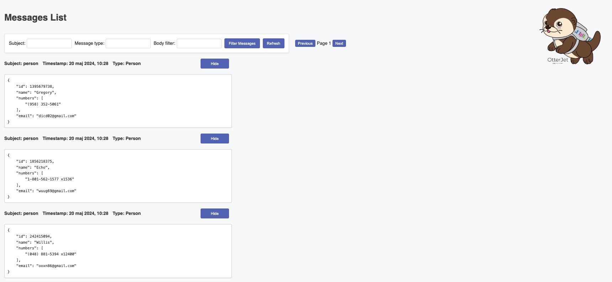
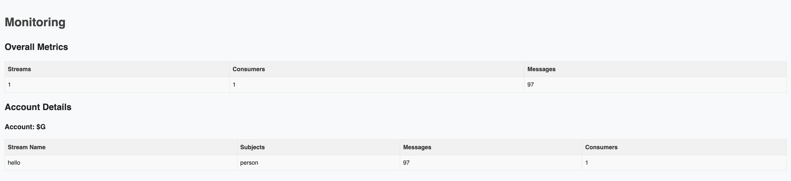

    

# Welcome!

# OtterJet

OtterJet is a project designed to provide a visualization of messages from a NATS JetStream server. Offering a WEB interface for interacting with NATS JetStream servers.
This project is particularly useful for developers who need to monitor traffic during development.

## Prerequisites

- Java 17 or higher
- NATS JetStream server

## Features

- Reads messages from a NATS JetStream server.
- Deserializes messages based on the specified mode (protobuf or plaintext for now).
- Filters messages based on subject, type, and body content.
- Displays monitoring information in a web interface.

## Setup

1. Clone the repository.
2. Navigate to the project directory.
3. Run `mvn clean install` to build the project.
4. Configure your NATS JetStream server details in the `application.properties` file.

## Configuration

The following properties need to be set in the `application.properties` file:

- `read.mode`: The mode to use for deserialization (either `proto` or `plaintext`).
- `read.subject`: The subject to read messages from.
- `read.proto.pathToDescriptor`: The path to the protobuf descriptor file (only required if `read.mode` is set to `proto`).
- `read.store.limit`: The maximum number of messages to store in memory. Default - 10000
- `read.startDate`: Optional date from which to start reading messages.

## Usage

After building the project, you can run it using the command `mvn spring-boot:run`.

## Web Interface

### Messages page

### Monitoring page

## Troubleshooting

If you encounter any issues while setting up or running the project, please check the following:

- Ensure that your NATS JetStream server is running and accessible.
- Verify that the configuration properties in the `application.properties` file are correct.

## Contributing

All suggestions are welcome :)

## Copyright

Copyright (C) 2023-2024 SoftwareMill [https://softwaremill.com](https://softwaremill.com).